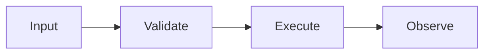

# Plain Senior Output

Use this contract for user-facing output from every workflow skill.

## Rule

Start with the decision. Then show the proof. Then show the next move.

Plain Senior means short, concrete, human prose. It does not mean childish prose.

## Default Shape

Use this shape unless the skill needs a stricter artifact format:

````markdown
## Decision
<one sentence>

## Why
<plain reason, tied to evidence>

## Example
```ts
<small code, command, diff, mermaid, or pseudocode example>
```

## Risk
<what could still fail, or "None known">

## Next
<exact handoff or command>
````

## Rules

- One screen by default.
- One idea per paragraph.
- Active voice.
- Concrete nouns.
- Short headings.
- Bullets only when they help scanning.
- No ceremony sections.
- No repeated summaries.
- No unexplained jargon. Define it inline in six words or fewer.
- No hedge words that hide the decision.
- Every final skill output includes one useful example: command, code, diff, pseudocode, mermaid, or exact file path.

## Examples

Use a command example for workflow status:

```bash
gh pr checks 42 --watch --fail-fast
```

Use a code example for an interface or mechanism:

```ts
type RetryPolicy = {
  readonly attempts: number
  readonly delayMs: number
}
```

Use a diff when the skill proposes a text change:

```diff
- Hidden fallback returns cached data.
+ Provider failure returns a typed error.
```

Use mermaid only when the picture is clearer than prose:



## Forbidden

- Long mechanical templates when three sections would do.
- Tables with more than five columns.
- Lists of files when a behavior summary is clearer.
- "Basically," "essentially," "it is worth noting," and similar filler.
