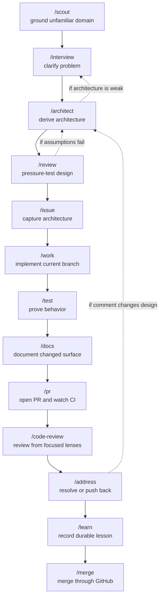
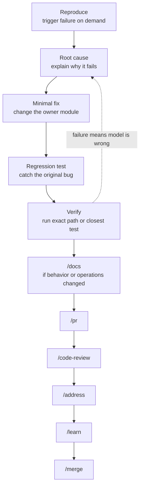
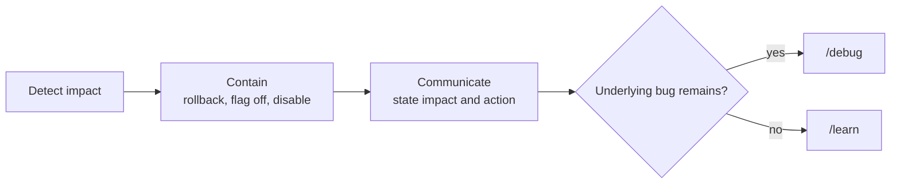
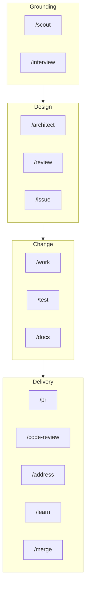
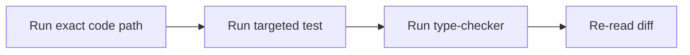
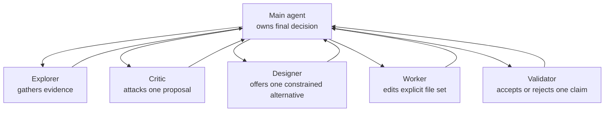

# Skills and Workflow

This repository defines a production-oriented agent workflow as a set of reusable skills.
Each skill has one job, an explicit precondition, and a handoff point. The goal is to keep work correct, observable, reviewable, and easy to operate under pressure.

## Core Model

The workflow is a compound loop:

1. Ground the problem.
2. Lock the architecture.
3. Execute the smallest correct change.
4. Prove it works.
5. Document only changed behavior.
6. Open, review, address, learn, and merge.

The main trade-off is speed for evidence. The loop adds ceremony only where it prevents hidden assumptions, weak designs, untested behavior, or unclear ownership.

## Skill Map

| Stage | Skill | Purpose |
|---:|---|---|
| 0 | `/scout` | Grounds an unfamiliar domain, library, module, service, or pattern before design work. |
| 1 | `/interview` | Clarifies the problem, constraints, intended direction, non-goals, and failure modes. |
| 2 | `/architect` | Derives the simplest correct architecture from first principles. |
| 3 | `/review` | Pressure-tests the architecture before implementation. |
| 4 | `/issue` | Creates a GitHub issue that captures the locked architecture. |
| 5 | `/work` | Implements the issue on the current branch and commits implementation changes. |
| 6 | `/test` | Adds missing edge-case tests and runs the tightest verification loop. |
| 7 | `/docs` | Updates documentation for changed behavior, APIs, config, or operations. |
| 8 | `/pr` | Opens the pull request and waits for CI. |
| 9 | `/code-review` | Runs focused reviewer passes and posts actionable PR feedback. |
| 10 | `/address` | Triages and resolves PR comments, or pushes back with a cited reason. |
| 11 | `/learn` | Records the post-mortem lesson from the full change cycle. |
| 12 | `/merge` | Merges the green, reviewed PR through GitHub with head-SHA protection. |

Alternative entry points:

| Skill | Use When |
|---|---|
| `/debug` | There is a concrete bug. It starts with reproduction, then root cause, fix, tests, docs, PR, review, address, learn, and merge. |
| `/incident` | Production is under pressure. It prioritizes containment, communication, and handoff before normal debugging. |
| `/teach` | A concept or solution needs to be explained in a structured learning format. |
| `/improve-architecture` | The goal is to find architecture improvements, deeper modules, or testability improvements. |
| `frontend-design` | The task is a production-grade frontend interface, page, component, app, or visual polish pass. |
| `emil-design-eng` | The task needs high-quality UI polish, interaction design, or component feel. |
| `emilkowal-animations` | The task involves transitions, gestures, motion, drawers, toasts, or animation details. |

## Main Workflow



`/scout` is optional. Use it when the domain is unfamiliar enough that interviewing or designing would otherwise be guesswork. If `/scout` is skipped, `/architect` must do equivalent grounding before design.

## Debug Workflow



`/debug` refuses to fix without a reproduction because an unobserved failure cannot be proven fixed.

## Incident Workflow



`/incident` is the production-pressure path. Containment beats process when the system is actively unsafe.

## Skill Boundaries



Each boundary protects a different risk:

- Grounding protects against guessing.
- Design protects against accidental complexity.
- Change protects against unverified behavior.
- Delivery protects against unreviewed or unexplained production changes.

## Grounding Tools

| Question | Preferred Tool |
|---|---|
| What does this library or API promise? | `context7` or official docs |
| What does the installed package actually do? | `node_modules` source and types |
| How is this pattern used in real repositories? | `gh_grep` |
| Where does this structural pattern exist locally? | `ast-grep` |
| What is current or external state? | `exa` or official online sources |
| What does this repo already do? | `rg`, tests, source, and local docs |

Grounding happens before advice or code when the answer depends on external behavior, current service state, package semantics, or library configuration.

## Operating Rules

- Do not start `/work` without an issue.
- Do not start `/test` without implementation work and an issue or discoverable issue reference.
- Do not start `/docs` without tested implementation work and an issue or discoverable issue reference.
- Do not start `/pr` until implementation, tests, and docs are complete.
- Do not start `/code-review` without a PR.
- Do not start `/address` without PR review comments.
- Do not use `/merge` until the PR is clean, reviewed, green, learned, and pushed.
- Do not merge directly to trunk except through the incident path with explicit confirmation.

## Verification Standard

Work is complete only when the requested behavior has been exercised through the strongest available feedback loop:



The strongest available proof should be used. If a stronger proof cannot run in the environment, record what was not verified.

## Subagents

Subagents are useful when work is bounded, independent, and evidence quality improves through parallelism.



The main agent keeps ownership of synthesis, edits outside delegated scope, verification, commits, posted comments, and handoff.

## File Layout

Canonical skills live under:

```text
skills/<name>/SKILL.md
```

Shared references live under:

```text
skills/_shared/
```

The `sync.ts` script is the authoritative sync path for generated skill directories. It replaces generated user skill trees from the canonical `skills/` tree and preserves Codex-managed system skills.
