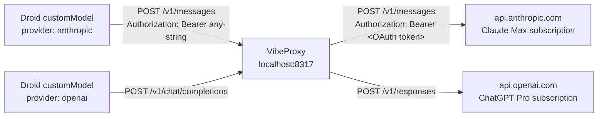
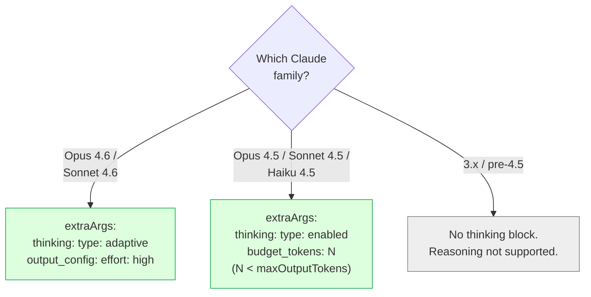
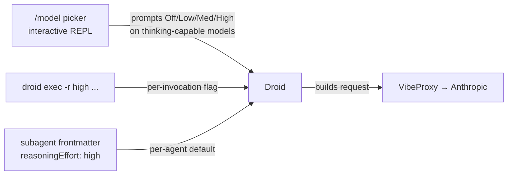

# VibeProxy — nuances and gotchas

Operational reference for VibeProxy as used by Droid's BYOK custom models in
`droid/settings.json`. Everything here was discovered the hard way. Read
before editing `customModels` or `sync.sh`'s heredoc.

## What VibeProxy actually is

A local reverse proxy at `http://localhost:8317` that speaks the Anthropic
Messages API and the OpenAI Responses/Chat-Completions API on its public
side, and terminates the upstream call as an **OAuth-authenticated** request
against your real subscription (Claude Max, ChatGPT Pro, GitHub Copilot, …).

Consequence: VibeProxy is **not** a credential vault. The `apiKey` field in
any Droid custom model entry can be literally any non-empty string — the
proxy only checks it exists, then swaps in the OAuth token it already holds
for the upstream provider. We pass `${CLI_PROXY_API_KEY}` from Infisical for
consistency, not because the proxy cares about the value.



## The model-id traps

### Claude IDs use dashes, not dots

```
claude-opus-4-6     ✓ routes
claude-opus-4.6     ✗ {"error": "unknown provider for model claude-opus-4.6"}
```

`claude-opus-4.6` with a dot is what the article at `x.com/0xSero/status/…`
uses in its screenshot, and what was in `droid/settings.json` until commit
`fc0a24f` — silently broken. The proxy's `/v1/models` listing is the ground
truth; scrape it any time with:

```bash
curl -s -H "Authorization: Bearer any" http://localhost:8317/v1/models | jq '.data[].id'
```

### GPT IDs use dots AND support a reasoning suffix in parens

```
gpt-5.4          ✓  default reasoning effort
gpt-5.4(low)     ✓  low
gpt-5.4(medium)  ✓
gpt-5.4(high)    ✓
gpt-5.4(xhigh)   ✓
gpt-5.3-codex(xhigh)  ✓
```

The suffix is a **VibeProxy-specific** sugar — it's not in the OpenAI API.
VibeProxy strips the parenthetical and maps it to the reasoning effort
parameter on the upstream Responses call. Treat each `(effort)` variant as a
distinct logical model and give it its own `customModels` entry; Droid shows
them as separate options in the picker.

### Provider family → base URL

| `provider` field | baseUrl must | Upstream path |
|---|---|---|
| `"anthropic"` | end **without** `/v1` → `http://localhost:8317` | VibeProxy auto-prefixes `/v1/messages` |
| `"openai"` | end **with** `/v1` → `http://localhost:8317/v1` | `/v1/chat/completions` or `/v1/responses` |
| `"generic-chat-completion-api"` | end **with** `/v1` | `/v1/chat/completions` |

Mixing those up is the second most common cause of 404s (after model id
typos). The Anthropic path is the asymmetric one and the one that usually
bites.

## Extended thinking on Claude BYOK — the big one

This is the entire point of writing this file down. Different Claude
families accept different thinking schemas, and the failure modes are
silent or misleading.



### Adaptive thinking (4.6 only)

4.6 models **do not accept** `type: "enabled"` anymore — it's deprecated in
favor of `adaptive`. Conversely, 4.5 and Haiku 4.5 **reject** `adaptive`
with `{"message": "adaptive thinking is not supported on this model"}`.

The depth control for adaptive lives at the **top level** of the request,
not inside `thinking`:

```jsonc
// correct — output_config is a sibling of thinking, not nested
"extraArgs": {
  "thinking": { "type": "adaptive" },
  "output_config": { "effort": "high" }   // "low" | "medium" | "high"
}
```

Nesting it is a hard error:

```jsonc
"thinking": { "type": "adaptive", "effort": "high" }
// 400: "thinking.adaptive.effort: Extra inputs are not permitted"
```

### Enabled thinking (4.5 family + Haiku 4.5)

```jsonc
"extraArgs": {
  "thinking": { "type": "enabled", "budget_tokens": 32000 }
}
// maxOutputTokens must be strictly > budget_tokens on the SAME entry
```

Haiku 4.5 does support thinking in enabled mode despite being the smallest
model — verified against VibeProxy. If Anthropic later removes it, the
failure is a 400 with a clear error; no silent fallback.

### What NOT to put in `extraArgs`

Specifically the three fields the article floating around copy/pastes and
which triggered the original 400 that commit `90e2669` misdiagnosed:

```jsonc
"extraArgs": {
  "thinking": { "type": "adaptive" },
  "output_config": { "effort": "high" },
  "max_tokens": 64000     // ← REMOVE. Collides with Droid's own max_tokens
                          //   handling and causes 400 or clobbers the
                          //   effective limit. Use the top-level
                          //   "maxOutputTokens" field on the customModel
                          //   entry instead.
}
```

`output_config` on its own is fine (required for adaptive effort). It's the
`max_tokens` *inside* extraArgs that fights Droid.

### Tested `maxOutputTokens` ceilings per model

All of these have been accepted by VibeProxy end-to-end in this session.
They're not theoretical.

| Model | maxOutputTokens | budget_tokens |
|---|---:|---:|
| Claude Opus 4.6 | 128000 | (adaptive) |
| Claude Sonnet 4.6 | 128000 | (adaptive) |
| Claude Opus 4.5 | 64000 | 32000 |
| Claude Sonnet 4.5 | 64000 | 32000 |
| Claude Haiku 4.5 | 32000 | 16000 |

Invariant: `budget_tokens < maxOutputTokens`, strictly. Equal fails.

## Reasoning effort in Droid — the Tab myth

**Tab does not cycle reasoning.** Nothing in Factory's public docs binds
plain Tab to a reasoning control. The only documented Tab-family shortcut
is **`Shift+Tab`**, which cycles *operational modes* (coding ↔ spec), not
thinking effort. Commit `90e2669` ("use Tab for reasoning") was wrong on
two counts: the fix removed `extraArgs` that Droid actually needs, and the
mechanism it pointed users to doesn't exist.

The three supported ways to set reasoning effort are:



Critical dependency: `reasoningEffort` is the **signal** (how hard to
think); `extraArgs.thinking` is the **plumbing** (is a thinking block
sent at all). You need both. Setting only `reasoningEffort: high` on an
entry without `extraArgs.thinking` results in a normal non-reasoning
request and zero thinking tokens — silently.

## Subagent frontmatter references custom IDs

Droid subagents in `droid/droids/*.md` reference the `customModels[].id`
value directly via `model: custom:<id>`. Example:

```yaml
---
name: smart
model: custom:Claude-Opus-4.6-2
---
```

Two failure modes to watch for:

1. **Renaming a custom ID orphans every subagent that used it.** When you
   change `custom:Claude-Opus-4.6-Thinking-High-[Anthropic-Max]-2` to
   `custom:Claude-Opus-4.6-2`, grep the whole repo for the old string and
   update subagents in lockstep. Droid fails open here — the subagent
   silently falls back to the default model, no error.
2. **Subagents reference the `id`, NOT the `model` field, NOT the
   `displayName`.** Using `custom:claude-opus-4-6` (the upstream model
   field) or `custom:Claude Opus 4.6` (the display name) produces an
   "unknown model" validation error.

## Manual VibeProxy testing

One-liners for poking the proxy directly when Droid behavior is
surprising. All use a dummy bearer because VibeProxy doesn't validate it.

```bash
# 1. List all models the proxy is advertising (model-id ground truth)
curl -s -H "Authorization: Bearer x" http://localhost:8317/v1/models \
  | jq '.data[] | {id, owned_by}'

# 2. Anthropic path, no thinking
curl -s -H "Authorization: Bearer x" -H "Content-Type: application/json" \
  -X POST http://localhost:8317/v1/messages -d '{
    "model": "claude-opus-4-6",
    "messages": [{"role": "user", "content": "ping"}],
    "max_tokens": 256
  }'

# 3. Anthropic path, adaptive thinking with high effort
curl -s -H "Authorization: Bearer x" -H "Content-Type: application/json" \
  -X POST http://localhost:8317/v1/messages -d '{
    "model": "claude-opus-4-6",
    "messages": [{"role": "user", "content": "17th Fibonacci?"}],
    "max_tokens": 4096,
    "thinking": {"type": "adaptive"},
    "output_config": {"effort": "high"}
  }'

# 4. Anthropic path, enabled thinking on 4.5
curl -s -H "Authorization: Bearer x" -H "Content-Type: application/json" \
  -X POST http://localhost:8317/v1/messages -d '{
    "model": "claude-sonnet-4-5-20250929",
    "messages": [{"role": "user", "content": "17th Fibonacci?"}],
    "max_tokens": 8192,
    "thinking": {"type": "enabled", "budget_tokens": 4096}
  }'

# 5. OpenAI path with reasoning suffix
curl -s -H "Authorization: Bearer x" -H "Content-Type: application/json" \
  -X POST http://localhost:8317/v1/chat/completions -d '{
    "model": "gpt-5.4(high)",
    "messages": [{"role": "user", "content": "ping"}],
    "max_tokens": 256
  }'
```

A successful thinking call returns `content: [{type: "thinking", …},
{type: "text", …}]`. If you get only `text`, the thinking block didn't
fire — recheck `type`, effort location, and that the upstream model
actually supports thinking in that mode.

## Gotcha log — lessons from wrong commits

| Commit | Symptom | Wrong diagnosis | Actual cause |
|---|---|---|---|
| `90e2669` | 400 on Claude Opus 4.6 | "extraArgs.thinking causes 400; use Tab instead" | `max_tokens: 64000` *inside* extraArgs collided with Droid's own max_tokens handling. The `thinking` block itself is fine. Tab has never been a reasoning control. |
| `fc0a24f` (first half) | Silent no-reasoning after the previous "fix" | "Tab cycles reasoning for custom models" | Tab doesn't. The custom model had no `extraArgs.thinking` at all, so Droid was sending plain non-reasoning requests regardless of effort setting. Restoring `extraArgs` per this doc was the real fix. |
| earlier than `fc0a24f` | `sessionDefaultSettings.model` silently resolved to nothing | Assumed `customModels` merged across `settings.json` + `settings.local.json` even with mismatched IDs | They merge, but references don't fuzzy-match — the ID strings must be identical. `sync.sh`'s heredoc generated short IDs while the main `settings.json` used descriptive ones. |

## Checklist before editing `customModels`

- [ ] Model id matches what `/v1/models` actually advertises (copy/paste, don't type it).
- [ ] `provider` and `baseUrl` agree on the `/v1` suffix rule.
- [ ] For Claude 4.6: `extraArgs.thinking.type = "adaptive"` + `output_config.effort`. No `budget_tokens`.
- [ ] For Claude 4.5 / Haiku 4.5: `extraArgs.thinking.type = "enabled"` + `budget_tokens`. No `output_config`.
- [ ] `maxOutputTokens` strictly greater than any `budget_tokens`.
- [ ] **No** `max_tokens` inside `extraArgs` — use `maxOutputTokens` on the entry.
- [ ] If renaming an `id`: grep the repo for the old string and update `sessionDefaultSettings`, subagent frontmatter in `droid/droids/`, and the `sync.sh` heredoc.
- [ ] `droid/settings.json` and `sync.sh`'s heredoc have identical `customModels` (IDs, indices, extraArgs, maxOutputTokens). A mismatch silently breaks `sessionDefaultSettings` resolution.
- [ ] Restart Droid after the edit — settings are read at startup only.
